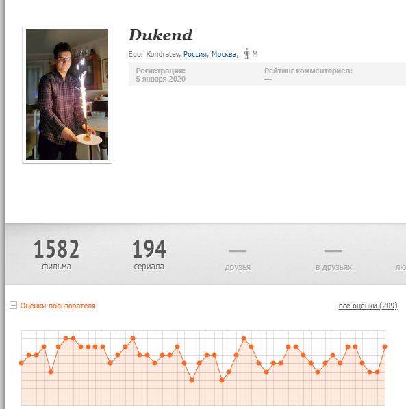
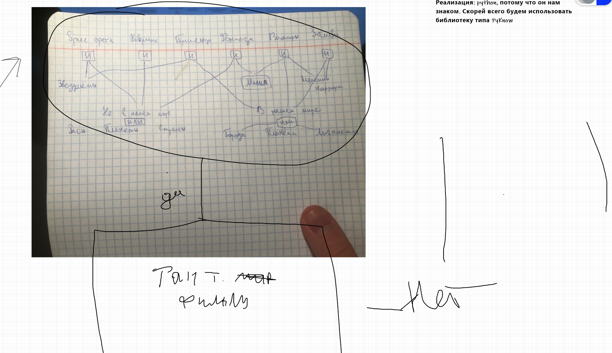
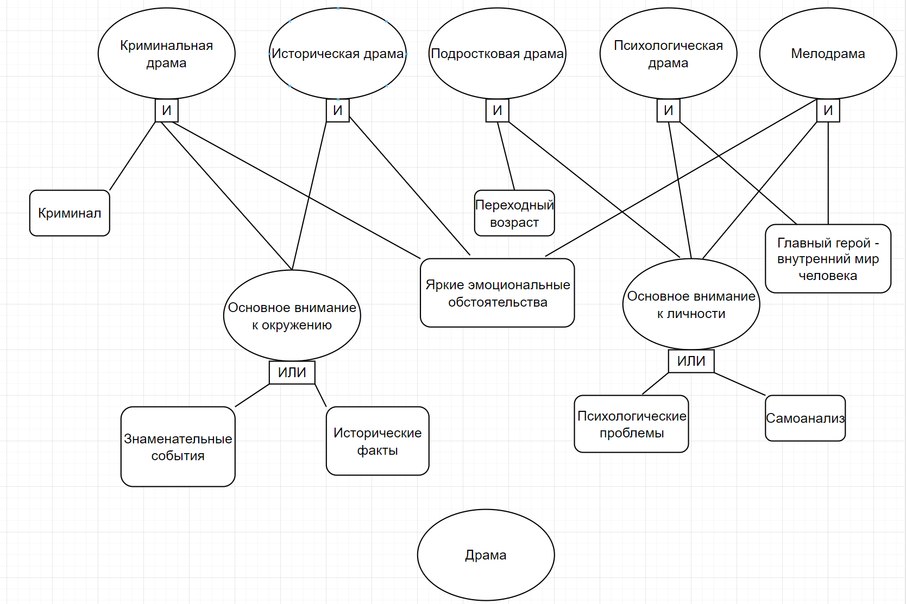
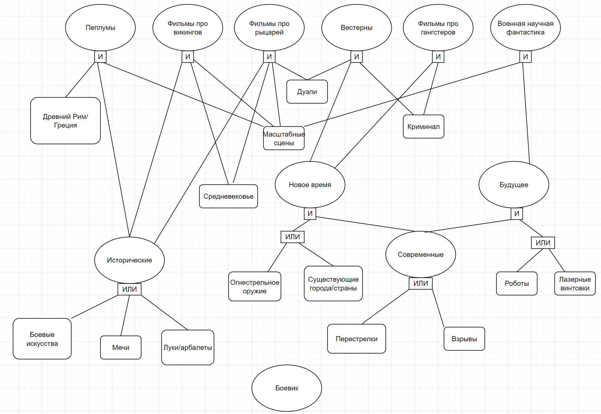
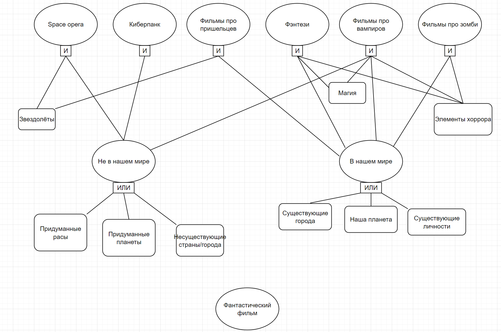
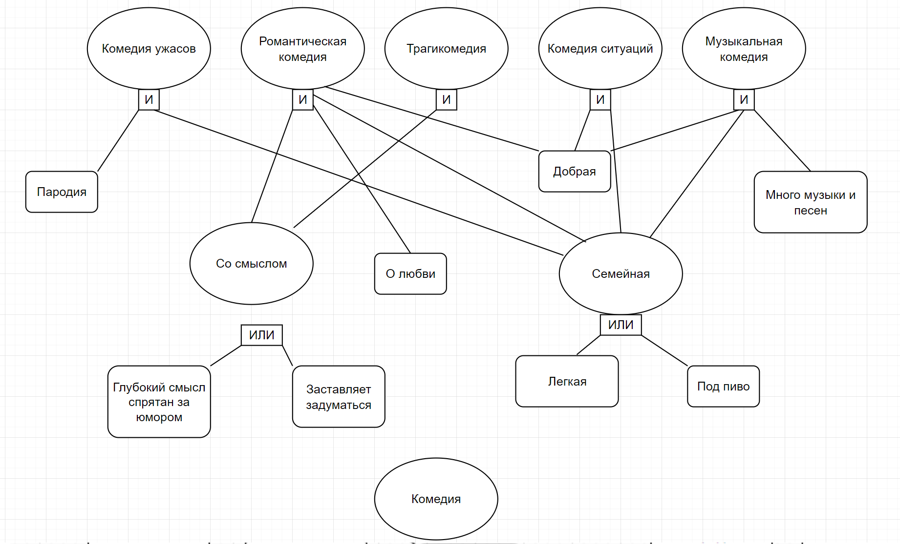
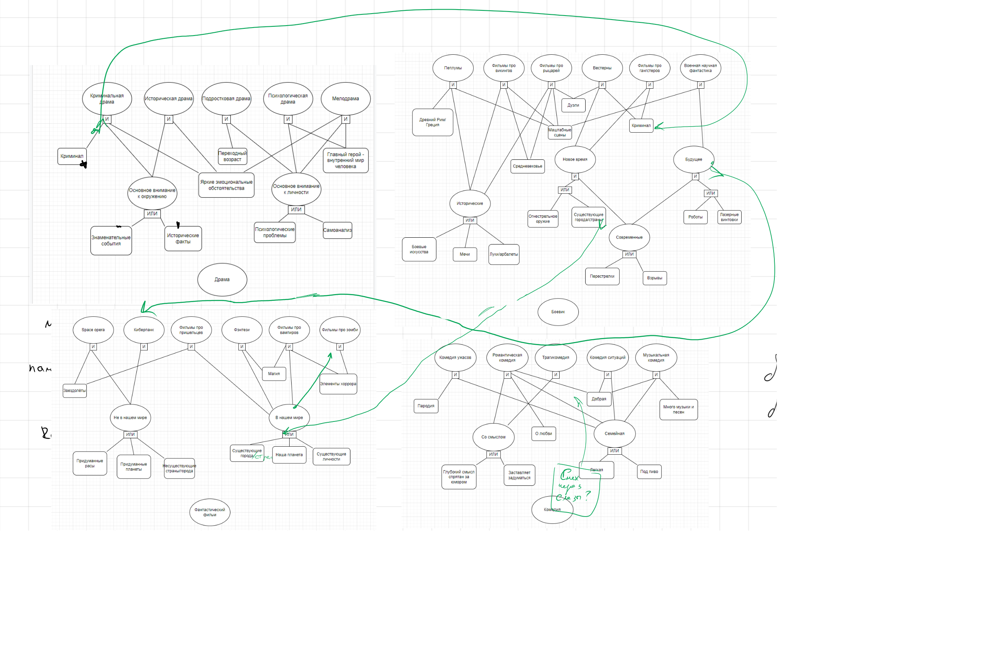
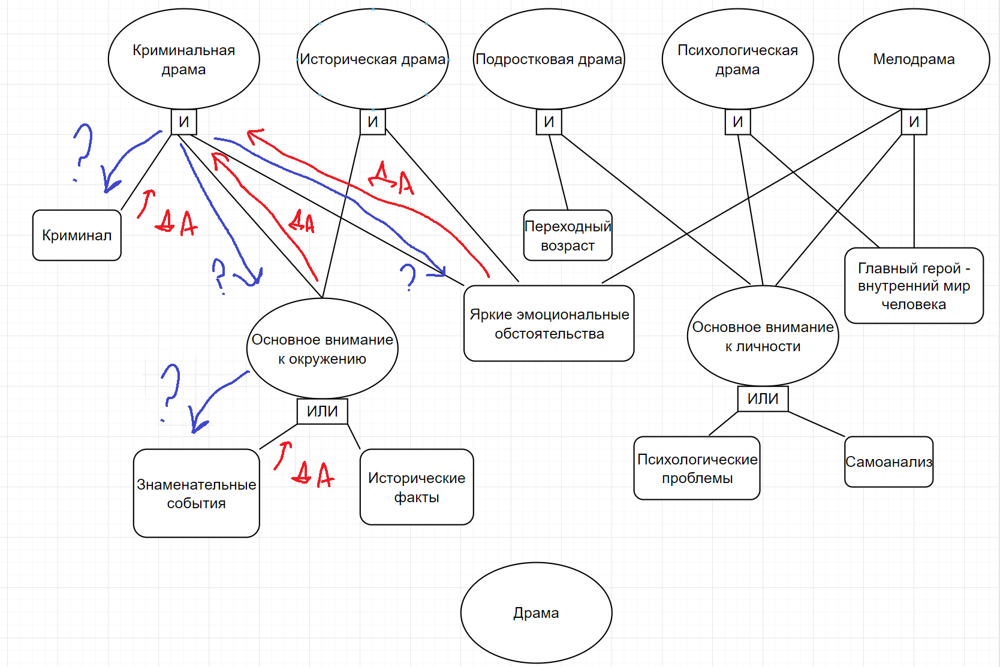

# Отчет по лабораторной работе
## по курсу "Искусственый интеллект"

### Студенты: 

| ФИО       | Роль в проекте                     | Оценка       |
|-----------|------------------------------------|--------------|
| Кондратьев Егор Алексеевич | Реализовация ЭС на `python`, написание отчёта, заполнение вопросов, правил и примеров  |       |
| Суханов Егор Алексеевич    | Основная реализовация ЭС на `python`, заполнение вопросов и правил, тестирование       |       |
| Аминов Степан Сергеевич    | Описание схемы предметной области, заполнение примеров                                 |       |


## Результат проверки

| Преподаватель     | Дата         |  Оценка       |
|-------------------|--------------|---------------|
| Сошников Д.В. |              |      4.8         |

> *Комментарии проверяющих (обратите внимание, что более подробные комментарии возможны непосредственно в репозитории по тексту программы)*

## Тема работы

Экспертная система по рекомендации поджанра фильмов и вывода прекрасных представителей этих поджанров на основе анализа его ответов.

## Концептуализация предметной области

<!-- Опишите результаты концептуализации предметной области:
 - выделенные понятия
 - связи между ними, тип получившейся онтологии (словарь, сеть, иерархия и т.д.)
 - опишите возможные статические и динамические знания
 - как предметная область может быть разделена между участниками для коллективного создания базы знаний  -->
 
Сейчас, как по мне, на поиск фильма уходит очень много временени, если ты увлекаешься кино много посмотрел и не хочешь тратить время на откровенное проходное кино.
 
 
 
 
 
Если размышлять об этом, как бы хотелось вечерком пройти какой-нибудь опросик эксперта, и не тратить по часу и более на поиск фильмаю
Чтобы он давал тебе какой-нибудь недооцененный или просто хороший фильм, который ты еще не посмотрелю
Ведь сейчас многие топы занимают глупые фильмы просто потому, что они легкие для восприятия. 
Да, конечно я и сам не против иногда посмотреть такое, но когда есть желание чего-то сложного, например, Андрей Рублев, Великая Красота, старикам тут не место и тд, то вот ТАКОЕ нужно искать долго, например, по режиссеру.

В этом и заключается идея нанего проекта.


## Принцип реализации системы

<!-- Опишите:
 - Какой механизм вывода вы предполагаете использовать и почему
 - Какую систему программирования вы предполагаете использовать и почему
 - Если это имеет смысл, приведите графическую иллюстрацию архитектуры системы. Если система состоит из разных частей (бот, механизм вывода) - опишите принципы интеграции -->
 Для данной лабораторной можно использовать как прямой, так и обратный вывод, но, в связи с древо-образной структурой, оптимальнее будет использовать обратный вывод, так как при нем будет проверяться наличие условий в рабочей памяти для текущего рассматриваемого ответа, избегая опроса о ненужных на данный момент условиях. Такой вывод очень легко реализуется с помощью Python'а.

Сама программа имеет простой интерфейс, выводящий вопрос и ожидающий ответ от пользователя. Вопросы задаются, пока не будет найдена подходящий поджанр и пока есть нерассмотренные вопросы. А также далее выводится наша подборка фильмов на итоговый поджанр. Хотя, конечно, в перспективе можно сделать сестему расширения экпертной системы, и умную подборку фильмов с запоминанием уже просмотренных, но это пусть будет на будущее.


Пример правил для блока жанра Драма

```
Rules = {
    # Драма
    'Криминал': Ask('Хотите фильм про криминал?'),
    'Знаменательные события': Ask('Хотите фильм про знаменитые события?'),
    'Исторические факты': Ask('Нравятся ли вам фильмы повествующие о исторических фактах?'),
    'Психологические проблемы': Ask('А как насчет фильма, где персонажи борются с психологическими проблемами?'),
    'Переходный возраст': Ask('Главный герой проходит через переходный возраст?'),
    'Главный герой - внутренний мир человека': Ask('А что насчет темы "Главный герой - внутренний мир человека"?'),
    'Самоанализ': Ask('Хотите увидеть глубокий самоанализ персонажей?'),
    'Яркие эмоциональные обстоятельства': Ask('Яркие эмоциональные обстоятельства в фильме?'),

    'Основное внимание к окружению': OR(['Знаменательные события', 'Исторические факты']),
    'Основное внимание к личности': OR(['Психологические проблемы', 'Самоанализ']),

    'Криминальная драма': AND(['Криминал', 'Основное внимание к окружению', 'Яркие эмоциональные обстоятельства']),
    'Историческая драма': AND(['Основное внимание к окружению', 'Яркие эмоциональные обстоятельства']),
    'Подростковая драма': AND(['Переходный возраст', 'Основное внимание к личности']),
    'Психологическая драма': AND(['Основное внимание к личности', 'Главный герой - внутренний мир человека']),
    'Мелодрама': AND(['Основное внимание к личности', 'Яркие эмоциональные обстоятельства', 'Главный герой - внутренний мир человека']),

    # Боевик
    'Древний Рим/ Греция': Ask('Нравятся ли вам фильмы про античность?'),
```
 

## Механизм вывода

<!-- Опишите, как работает механизм вывода. Наиболее интересные фрагменты кода приведите в отчете. -->
Мы воспользовались механизмом обратного вывода, который пытается как бы "угадать ответ", перебирая все варианты ответов. Так как заранее многие параметры неизвестны, система уточняет их через диалог с пользователем. По ходу получения информации предположение может оказаться ошибочным, тогда система переходит к следующему предположению. Вся информация при этом сохраняется в памяти системы.

Программа имеет очень простой механизм вывода.
Мы можем: 
- Проверить наличие факта в рабочей памяти. Факт может быть успешным и проваленным;
- Спросить пользователя о данном факте и сохранить ответ;
- Попробовать вывести итоговый поджанр, если факты удовлетворяют.

## Извлечение знаний и база знаний

Над созданием базы знаний работал в основном один человек, все остальные лишь делали правки и вставляли свои пять копеек.

Сначала мы предпологали использование датасета c Kaggle, но поняли, что это будет обычная работа с таблицами. Это интересно, но не вписывается в идею этой лабораторной, на наш взгляд.

Поэтому мы решили раздробить жанры на поджанры и найти к ним их свойства. 
После того как все было собрано и какие-то множества были определены, построены сами деревья.

Было выбрано процедурное представление знаний, так как его графическое представление (дерево «И/ИЛИ») представляет собой граф.
Все данные статика.


З.Ы.  У нас в команде только два из трех человека увлекаются кино, поэтому коллективным созданием базы данных занималось 2 человека.

**Графическая иллюстрация:**

Когда мы определились с путем проекта, мы нарисовали один из жанров и расписали его.


**Драма**




**Боевик**




**Фантастика**




**Комедия**




Далее мы решили дабавить магистрали между жанрами, чтобы они не выглядели обособленно.


**Финальная реализация**




## Протокол работы системы

Пример вывода, когда на каждый вопрос дается ответ да:

```
Фильмы каких жанров вы хотите посмотреть?
Доступные жанры:
1 : Комедия
2 : Драма
3 : Боевик
4 : Фантастика
Например: '1 3' - выведет вам фильмы жанров комедия и боевик
2
---------- 

Хотите фильм про криминал? (Да/Нет): д
Хотите фильм про знаменитые события? (Да/Нет): д
Яркие эмоциональные обстоятельства в фильме? (Да/Нет): д
Я думаю, что тебе стоит посмотреть что-то в поджанре Криминальная драма
Фильмы, которые я рекомендую:
1 : Крестный отец
2 : Побег из Шоушенка
3 : Ирландец
Продолжить подбирать поджанры? (Да/Нет): н
```

**Дерево вывода в данном случае выглядет примерно так:**




Также по примеру видно что нами была реализованна идея, что, если пользователь получил ответ, он может продолжить быть опрашиваемым программой, с сохранением всех ответов в прошлом, без необходимости перезапуска.

```
2 3 4
---------- 

Хотите фильм про криминал? (Да/Нет): н
Хотите фильм про знаменитые события? (Да/Нет): н
Нравятся ли вам фильмы повествующие о исторических фактах? (Да/Нет): н
Главный герой проходит через переходный возраст? (Да/Нет): н
А как насчет фильма, где персонажи борются с психологическими проблемами? (Да/Нет): н
Хотите увидеть глубокий самоанализ персонажей? (Да/Нет): н
Хотите увидеть глубокий самоанализ персонажей? (Да/Нет): н
Нравятся ли вам фильмы про античность? (Да/Нет): н
Бои на мечах? (Да/Нет): д
Замки, чума и .... голод, одним словом: средневековье? (Да/Нет): д
Хочешь фильм с масштабными сценами? (Да/Нет): д
Я думаю, что тебе стоит посмотреть что-то в поджанре Фильмы про викингов
Фильмы, которые я рекомендую:
1 : Тринадцатый воин
2 : Викинги
3 : Беовульф
Продолжить подбирать поджанры? (Да/Нет): д
Хочешь фильм с дуэлями? (Да/Нет): д
Я думаю, что тебе стоит посмотреть что-то в поджанре Фильмы про рыцарей
Фильмы, которые я рекомендую:
1 : Последние рыцари
2 : Царство небесное
3 : История рыцаря
Продолжить подбирать поджанры? (Да/Нет): н
```

## Выводы

Экспертная система - это компьютерная программа, которая в некоторой области проявляет степень познаний сравнимую с работой человека-эксперта. Это очень удобно, ведь порой всем нам не нравится разговаривать с консультантами в магазине. Данная лабораторная работа помогла освежить знания курса Логическое программирование, а также пересмотреть кучу потрясающих и знаменитых фильмов.

Весь этап разработки мы взаимодействовали в команде. Для ускорения процесса разработки мы несколько раз встречались дискорде, а также освоили технологию совместного редактирования кода в Visual Studio Code. Мы долго и тщательно прорабатывали тему и концепцию нашей экспертной системы. К сожалению, в виду недостака знаний или опыта не получилось реализовать все изначальные идеи полностью, но всё же нам удалось выполнить задание по поставленным задачам.

**Заключение:**
- Корректно исполненная экспертная система способна эмулировать работу эксперта, но для ее создание нужно найти эксперта, способного структуризировать свои знания, и наблюдать за его работой, параллельно заполняя базу знаний. В зависимости от сложности и размера области, на это можешь уходить неограниченно много времени;
- Экспертная система работает только на статических знаниях и не предназначена для самообучения, что делает ее негибкой и требует наличие администратора, добавляющего новые знания и редактирующего известные, когда требуется;
- Существует множество инструментов, которые можно использовать в качестве движка экспертной системы. Наибольшей сложностью представляет разработка базы знаний.


