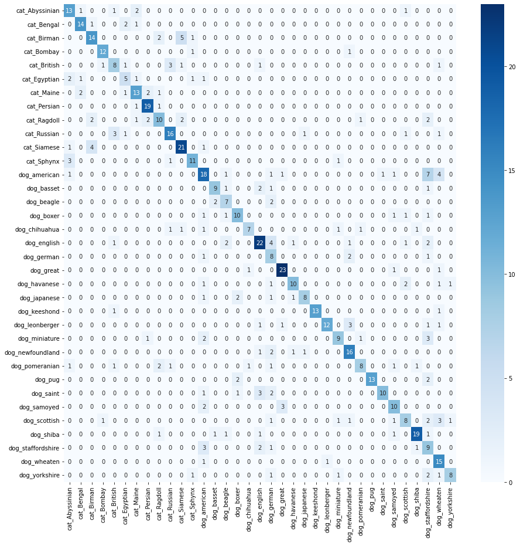
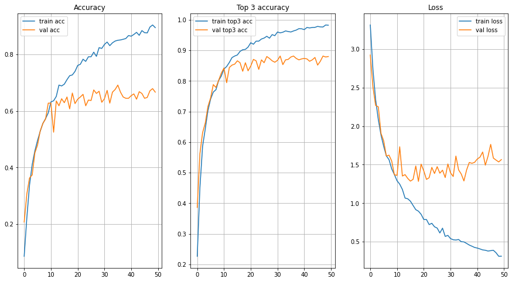
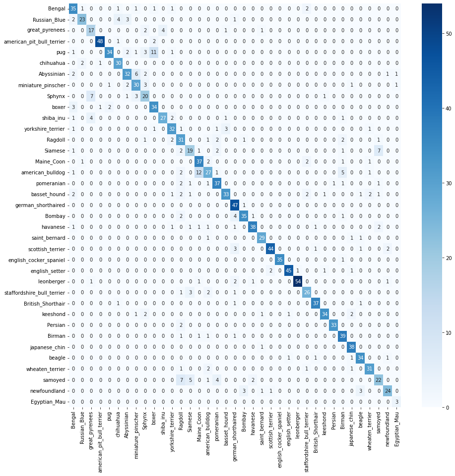
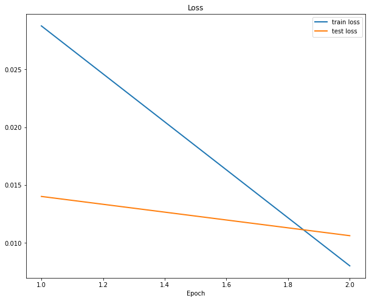
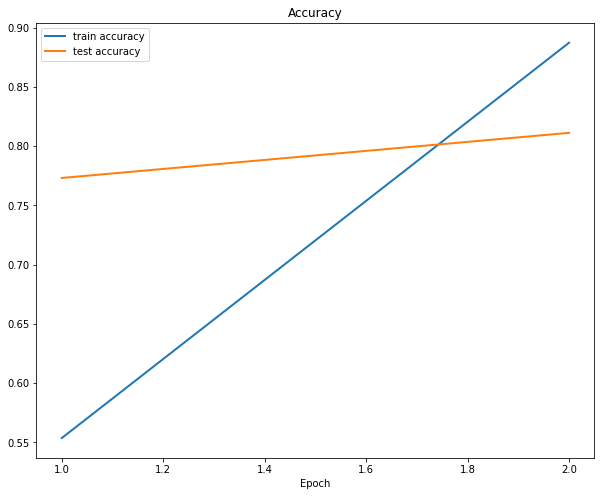

# Лабораторная работа по курсу "Искусственный интеллект"
# Классификация изображений.

| Студент | Кондратьев |
|------|------|
| Группа  | 6 |
| Оценка 1 (обучение "с нуля") | *X* |
| Оценка 2 (transfer learning) | *X* |
| Проверил | Сошников Д.В. |

> *Комментарии проверяющего*

### Задание

Решить задачу классификации пород кошек и собак на основе датасета [Oxford-IIIT](https://www.robots.ox.ac.uk/~vgg/data/pets/).


#### Задание 1: Классификация Pet Faces

Обучить свёрточную нейронную сеть для классификации пород кошек и собак на основе упрощённого датасета **Pet Faces**. Самостоятельно придумать архитектуру сети, реализовать предобработку входных данных.

Для загрузки датасета используйте следующий код:

```python
!wget https://mslearntensorflowlp.blob.core.windows.net/data/petfaces.tar.gz
!tar xfz petfaces.tar.gz
!rm petfaces.tar.gz
```

В качестве результата необходимо:

* Посчитать точность классификатора на тестовом датасете
* Посчитать точность двоичной классификации "кошки против собак" на текстовом датасете
* Построить confusion matrix
* **[На хорошую и отличную оценку]** Посчитайте top-3 accuracy
* **[На отличную оценку]** Выполнить оптимизацию гиперпараметров: архитектуры сети, learning rate, количества нейронов и размеров фильтров.

Решение оформите в файле [Faces.ipynb](Faces.ipynb).

Использовать нейросетевой фреймворк в соответствии с вариантом задания:
   * Чётные варианты - PyTorch
   * Нечётные варианты - Tensorflow/Keras
#### Задание 2: Классификация полных изображений с помощью transfer learning

Используйте оригинальный датасет **Oxford Pets** и предобученные сети VGG-16/VGG-19 и ResNet для построение классификатора пород. Для загрузки датасета используйте код:

```python
!wget https://mslearntensorflowlp.blob.core.windows.net/data/oxpets_images.tar.gz
!tar xfz oxpets_images.tar.gz
!rm oxpets_images.tar.gz
```

В качестве результата необходимо:

* Посчитать точность классификатора на тестовом датасете отдельно для VGG-16/19 и ResNet, для дальнейших действий выбрать сеть с лучшей точностью
* Посчитать точность двоичной классификации "кошки против собак" на текстовом датасете
* Построить confusion matrix
* **[На отличную оценку]** Посчитайте top-3 и top-5 accuracy

Решение оформите в файле [Pets.ipynb](Pets.ipynb).

Использовать нейросетевой фреймворк, отличный от использованного в предыдущем задании, в соответствии с вариантом задания:
   * Нечётные варианты - PyTorch
   * Чётные варианты - Tensorflow/Keras

## Codespaces

По возможности, используйте GitHub Codespaces для выполнения работы. По результатам, дайте обратную связь:
1. Что понравилось?
1. Что не понравилось?
1. Какие ошибки или существенные затруднения в работе вы встречали? (По возможности, будьте как можно более подробны, указывайте шаги для воспроизведения ошибок)

---

# Отчет
## Часть 1

В первой части мне нужно было придумать архитектуру сверточной нейронной сети для классификации изображений. Работал я на тензорфлоу.

Моя сверточная сеть выглядит так:  
[Свертка + Макс пулинг + Релу] x3 + Дропаут + Линейный слой + Софтмакс

Перед обучением выполняется аугментация изображений (отражение относительно оси у, поворот или зум с вероятностью 0.1) и нормировка (приведение всех чисел к интервалу [0; 1].

Лосс - кросс энтропия  
Оптимизатор - адам  
Лернинг рейт - 1е-3  
Эпохи - 50

Я пробовал изменять количество сверточных и линейных слоев, добавлять регуляризацию (дропаут с разными вероятностями, аугментацию данных), менять лернинг рейт и параметры сверток (размер ядра, количество выходных каналов). Полученная сеть оказалась наиболее точной.

Метрики:  
эккюраси = 0.67  
топ 3 эккюраси = 0.88  
точность бинарной классификации кошки vs собаки = 0.96  
Матрица неточностей:  
  
Графики лоссов и точностей в зависимости от эпох:  
  

Модель дала хорошую оценку вероятности обнаружения кошек и собак: видимость бинарной фильтрации равна 0,96, а также видимость того, что нижняя левая и верхняя правая части матрицы неточностей почти равны нулю (там, где видны кошки и собаки).

Определять непосредственно породы кошек и собак модель может не всегда. Имеем точность 0.67. Однако в 88% случаев правильная порода находится в топ 3 предсказаниях модели.

Сейчас у нас немного фотографий в датасете для каждого класса, поэтому стоит либо расширить датасет, либо попробовать пофайнтюнить нейросетку для получения лучшего результата

## Часть 2

Во 2 части мне нужно было использовать предобученные модели для классификации собак и кошек по породам. Здесь я работал на torch.

Я попробовал две сети: VGG-16 и ResNet-18. Обе сети были предобучены на ImageNet. В каждой сети я заменил последний полносвязный слой, чтобы на выходе у меня было не 1000 классов, а столько, сколько в моем датасете.

Так как модели предобучены, то они уже неплохо справляются с выделением фичей из картинок. Это значит, что не нужно много эпох на дообучение. Я решил сделать 2 эпохи обучения (я пробовал и больше - 10, но результат был примерно одинаковый, а времени уходило больше). Обе сети показали себя примерно одинаково - получили эккюраси 0.81-0.82.

Матрица неточностей:  


Графики лосса и эккюраси от эпох:  
  


Что касается бинарного значения кошек и собак:
К сожалению, по набору данных невозможно быстро понять, какая из пород относится к собакам, а какая к кошкам. А вот для ручной разметки времени уйдет уйма.
Но мы можем оценить точность по построенной сопряженной матрице. Считаю позиции с большими числами, не лежащими по диагонали. Там я видел несколько случаев, когда модель просто путала породы собак (или породы кошек). Но иногда она путает собак и кошек в прямом смысле. Но в целом таких случаев не так уж и много. 

Точность классификации кошек и собак равны 96% (а то и выше)

## Вывод

В этой работе я практиковал обучение сверточных нейронных сетей для классификации изображений. Я пробовал два подхода: сетевое обучение с нуля и трансферное обучение. Второй подход, конечно же, оказался более точным за счет инициализации модели весами, полученными после обучения на ImageNet.

Также я познакомился с фреймворком Tensorflow, над которым раньше никогда не работал. Оказалось, что это очень удобный инструмент, где большая часть работы уже сделана за нас. Но этот фреймворк не очень гибкий по сравнению с липким. Поэтому я бы использовал tensorflow для решения простых задач.
---

## Материалы для изучения

* [Deep Learning for Image Classification Workshop](https://github.com/microsoft/workshop-library/blob/main/full/deep-learning-computer-vision/README.md)
* [Convolutional Networks](https://github.com/microsoft/AI-For-Beginners/blob/main/4-ComputerVision/07-ConvNets/README.md)
* [Transfer Learning](https://github.com/microsoft/AI-For-Beginners/blob/main/4-ComputerVision/08-TransferLearning/README.md)
